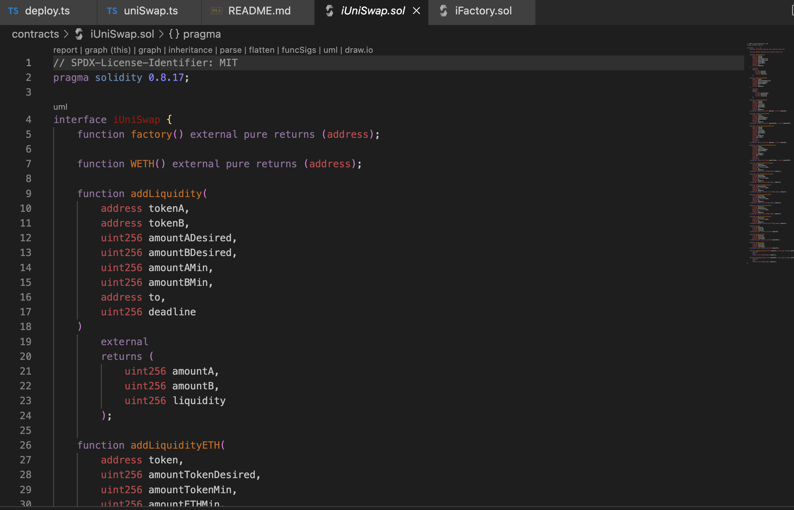

# UniSwap Interaction

## Web3Bridge First Eviction Test.

## Contents
* Introduction
* Languages
* Code Snippets
* Function Interactions

### Introduction
This project demonstrates how to fork the mainet and interact with a contract(UNISWAP) using scripts via Hardhat. It Utilizes the use interface to access functions within a contract to change states.
#### NB
Since the interactions is in a forked blockchain, state changes are not reflective on live network.

### Languages
* TypeScript
* Solidity

### Code Snippets
* interface

* Script

### Function Interactions
* function addLiquidity()
* function addLiquidityETH()
* function removeLiquidity()

